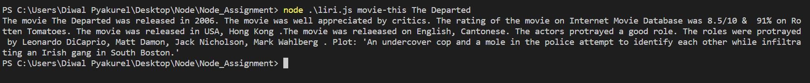

# Liri

### The Liri app will capture the input from the command line and will look into OMDB API or Spotify API or BandinTown API and will display the output.

Steps Followed for making this application work.

1. I captured the command line input of process.argv[2] and process.argv[3] or further into two different variables.
2. Then I used if/else to check if the process.argv[2] matches any condition. If matched with spotify then it will look into spotify API or bandinTown or OMDB.
3. For Spotify API, the user can also capture data from a .txt file. The funcion will read .txt file and search accordingly. 
4. For bandsintown, i used moment.js to get date and time in readable format.
5. Axios was used to send request to BandsinTown API and OMDB API.

### NPM Used
1. Spotify 
2. Axios
3. MomentJS
4. DotEnv

### Comand Line Argument used for the app
1. movie-his : Will look for movie
2. concert-this : Will look for artist concert
3. spotify-this : Will look for the track
4. do-what-it-says : Will capture the data from .txt file and search in Spotify API

###Screenshot of major Codes

###Screenshots of CommandLine

